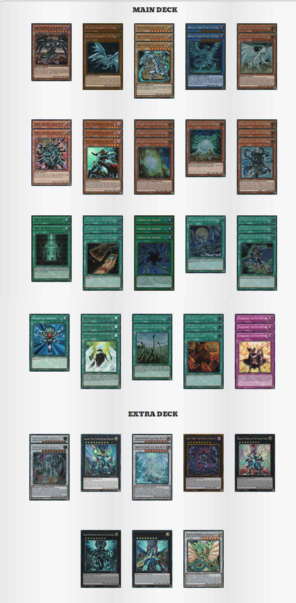

# DRAGON BLANC 2018

## Description : Deck liste Dragon blanc aux yeux bleu.
source : http://www.otk-expert.fr/yugioh/decks/dragon-blanc-2018-3/

   

MONSTRES (22)
1 Dragon Sombre Métallique aux Yeux Rouges
2 Dragon Blanc Alternatif aux Yeux Bleus
3 Dragon Blanc Aux Yeux Bleus
2 Dragon du Chaos MAX aux Yeux Bleus
2 Esprit du Dragon Blanc
2 Manju des Dix Mille Mains
3 Roi Seigneur des D
3 Pierre Blanche Ancienne
1 Pierre Blanche Légendaire
3 Sage avec des Yeux de Bleu

 

MAGIES (21)
2 Art Du Rituel Avancé
3 Cartes de l'Harmonie
3 Forme du Chaos
1 Hurlement d'Argent
3 La Mélodie du Réveil des Dragons
1 Monster Reborn
3 Rhapsodie de la Résurrection du Dragon
2 Sanctuaire du Dragon
3 Transaction

 

PIÈGES (3)
3 Vigilance de Champion

 

EXTRA DECK (10)
2 Dragon Argent aux Yeux Azur
1 Dragon Épée Cipher aux Yeux Galactiques
2 Dragon Esprit aux Yeux Bleus
1 Numéro 95 : Dragon Matière des Ténèbres aux Yeux Galactiques
1 Dragon Cipher aux Yeux Galactiques
1 Dragon Photon Armure Complète aux Yeux Galactiques
1 Numéro 62 : Dragon Photon Primordial Aux Yeux Galactiques
1 Ancien Dragon Féerique

  

