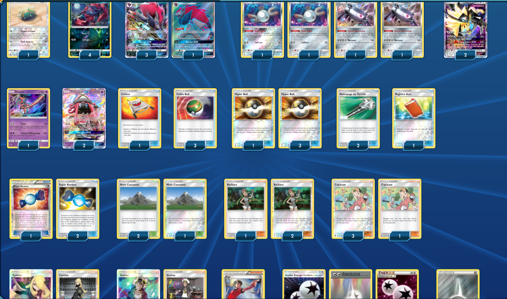

# Zoroark - Magnézone (Après Rotation)

 

****** Liste de deck du JCC Pokémon ******

##Pokémon - 18

* 1 Insolourdo CES 110
* 4 Zorua SLG 52
* 4 Zoroark-GX SLG 53
* 2 Magnéti UPR 81
* 2 Necrozma Crinière du Couchant-GX UPR 90
* 2 Magnézone UPR 83
* 1 Deoxys CES 67
* 2 Tokopiyon-GX GRI 60

##Cartes Dresseur - 31

* 1 Juge BKT 143
* 3 Cynthia UPR 119
* 3 Guzma BUS 143
* 3 Barbara GRI 127
* 4 Hyper Ball SUM 135
* 3 Super Bonbon PRC 135
* 2 Nettoyage de Terrain GRI 125
* 4 Copieuse CES 127
* 3 Mont Couronné UPR 130
* 1 Registre Ami UPR 132
* 3 Faiblo Ball SUM 123
* 1 Civière GRI 130

##Énergie - 11

* 3 Double Énergie Incolore SLG 69
* 8 Énergie Métal Energy 8

Nombre de cartes - 60

****** Liste générée par le JCC Pokémon Online [www.pokemon.fr/JCCO] ******

 

