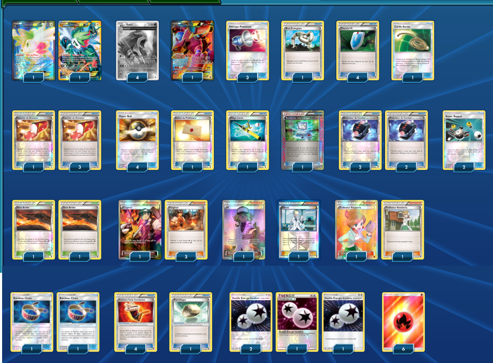

# Entei

### Description :

 

****** Liste de deck du JCC Pokémon ******

##Pokémon - 7

* 2 Shaymin-EX ROS 106
* 4 Entei AOR 15
* 1 Volcanion-EX STS 107

##Cartes Dresseur - 43

* 1 Recherche Informatique BCR 137
* 4 Courrier du Dresseur ROS 92
* 1 Bras Écologique AOR 71
* 1 Lettre du Professeur BKT 146
* 4 Hyper Ball SLG 68
* 2 Super Rappel CES 146
* 1 Nikolaï PLS 118
* 1 Méga Canne BKT 149
* 4 Forgeron FLF 88
* 1 Corde Sortie BUS 114
* 4 Réducteur de Combat Matos Team Flare PHF 92
* 3 Attrape-Pokémon SLG 64
* 4 Ceinture Furie Combative BKP 99
* 2 Terre Brûlée FCO 110
* 1 N FCO 105
* 2 Bandeau Choix GRI 121
* 1 Pierrallégée BKT 137
* 2 Professeur Keteleeria PLF 116
* 4 Cherche VS PHF 109

##Énergie - 10

* 4 Double Énergie Incolore SLG 69
* 6 Énergie Feu  11

Nombre de cartes - 60

****** Liste générée par le JCC Pokémon Online [www.pokemon.fr/JCCO] ******

 

