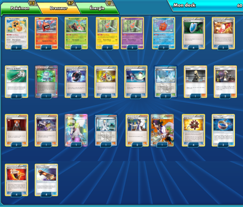

# Motisma

### Description : Les outils peuvent être changés sans trop de soucis (sachant qu'il faut au minimum 15 outils [9 à  défausser + 6 qui pourraient être dans les récompenses]. Les villes gelées peuvent-être remplacé par des chapelles des châtiments (tempête céleste) ou par Kokohiyo (moins bon des trois). Il est également possible de mettre un Motisma psy en plus (en enlevant un Motisma électrik) pour contrer plus de Pokemon notamment le type combat qui est assez présent. Enfin il est possible d'ajouter un Rattata d'alola et Rattatac d'alola GX afin de contrer les anti-talents [comme Miasmax ou Grotadmorv d'alola) - pour cela j'ai retiré un Motisma four et un courrier du dresseur - mais je suis pas convaincu. De plus Rattatac d'alola peut défausser des cartes pour taper (sans énergie)

 

** Liste de deck du JCC Pokémon **

##Pokémon - 13

* 2 Motisma Hélice UPR 110
* 3 Motisma Chaleur UPR 24
* 2 Motisma Tonte UPR 14
* 2 Motisma UPR 50
* 2 Motisma FLI 40
* 2 Motisma Froid UPR 41

##Cartes Dresseur - 47

* 3 Professeur Platane BKP 107
* 1 Recherche Informatique BCR 137
* 4 Ballon Explosif BKP 97
* 2 Courrier du Dresseur ROS 92
* 2 Lysandre FLF 90
* 2 Vélo Cross PRC 122
* 1 Marion PR-XY XY177
* 2 Ville Gelée PLF 100
* 4 Réducteur de Combat Matos Team Flare PHF 92
* 1 Cynthia UPR 119
* 4 Skateboard Évasion UPR 122
* 3 Nettoyage de Terrain GRI 125
* 2 Guzma BUS 115
* 1 Nikolaï PLS 118
* 4 Ceinture Furie Combative BKP 99
* 1 N NVI 101
* 3 Bandeau Choix GRI 121
* 3 Échange BCR 135
* 4 Cherche VS PHF 109

##Énergie - 0

Nombre de cartes - 60

** Liste générée par le JCC Pokémon Online [www.pokemon.fr/JCCO] **

 

