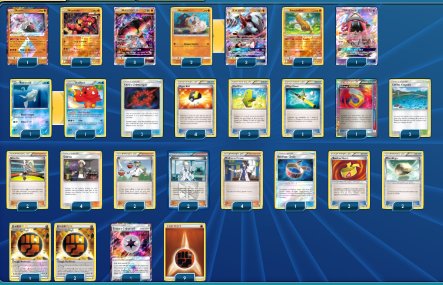

# Mouscoto-GX - Lougarock-GX

### Description : Mouscoto - Lougarock. Classique Etendu.

 

****** Liste de deck du JCC Pokémon ******

##Pokémon - 13

* 1 Diancie {*} FLI 74
* 1 Mouscoto FLI 77
* 3 Mouscoto-GX CIN 57
* 2 Rocabot FLI 75
* 1 Simularbre GRI 66
* 2 Lougaroc-GX GRI 74
* 1 Tokopiyon-GX GRI 60
* 1 Rémoraid BKT 32
* 1 Octillery BKT 33

##Cartes Dresseur - 34

* 4 Professeur Platane PHF 101
* 4 Guzma BUS 115
* 2 Cornélia FFI 95
* 2 Nikolaï PLS 118
* 2 N NVI 92
* 4 Hyper Ball DEX 102
* 3 Max Élixir BKP 102
* 3 Cercle Chimérique FLI 102
* 1 Méga Canne BKT 149
* 1 Échange Combiné PLS 129
* 2 Pierrallégée BKT 137
* 2 Bandeau Muscle XY 121
* 1 Bandeau Choix GRI 121
* 3 Colline Clapotis GRI 120

##Énergie - 13

* 9 Énergie Combat Energy 6
* 3 Énergie Renforcée FCO 115
* 1 Énergie Chimère {*} FLI 117

Nombre de cartes - 60

****** Liste générée par le JCC Pokémon Online [www.pokemon.fr/JCCO] ******

 

