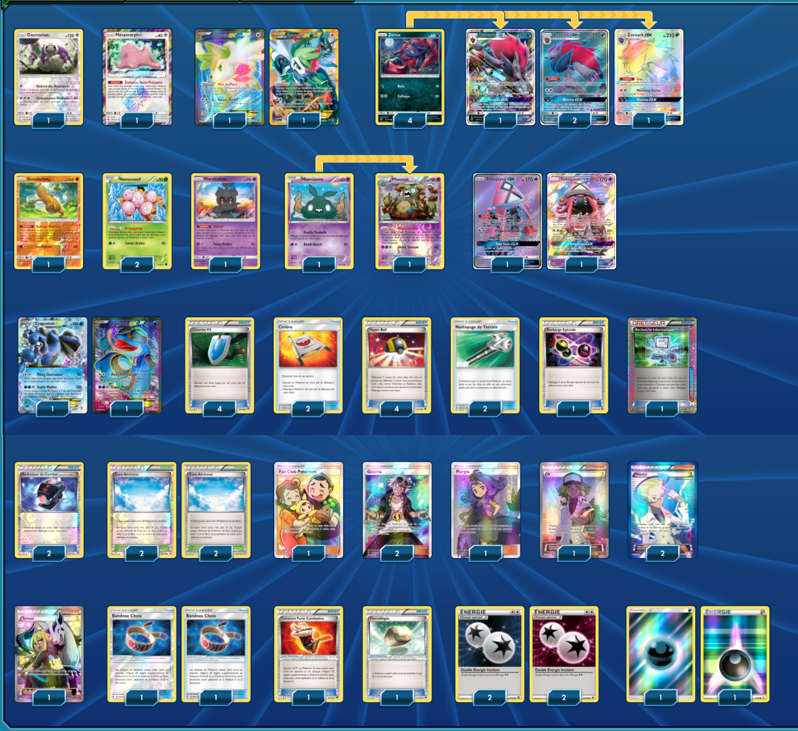

# Zoroark-GX - Crapustule-EX

### Description :

 

****** Liste de deck du JCC Pokémon ******

##Pokémon - 22

* 1 Gouroutan UPR 114
* 1 Métamorph {*} LOT 154
* 2 Shaymin-EX ROS 106
* 4 Zorua SLG 52
* 4 Zoroark-GX SLG 77
* 1 Simularbre GRI 66
* 2 Noeunoeuf PLF 4
* 1 Marshadow SLG 45
* 1 Miamiasme NVI 48
* 2 Tokopiyon-GX GRI 137
* 1 Miasmax DRX 54
* 2 Crapustule-EX FFI 106

##Cartes Dresseur - 32

* 1 Recherche Informatique BCR 137
* 1 Margie BUS 142
* 1 N FCO 105
* 2 Civière GRI 130
* 1 Fan Club Pokémon UPR 155
* 2 Bandeau Choix GRI 121
* 2 Réducteur de Combat Matos Team Flare PHF 92
* 2 Nikolaï PLS 135
* 1 Recharge Spéciale STS 105
* 2 Nettoyage de Terrain GRI 125
* 1 Ceinture Furie Combative BKP 99
* 1 Terreur BKP 98
* 2 Guzma BUS 143
* 4 Zone Aérienne ROS 89
* 1 Pierrallégée BKT 137
* 4 Hyper Ball FCO 113
* 4 Cherche VS PHF 109

##Énergie - 6

* 2 Énergie Obscurité  7
* 4 Double Énergie Incolore FCO 114

Nombre de cartes - 60

****** Liste générée par le JCC Pokémon Online [www.pokemon.fr/JCCO] ******

 

