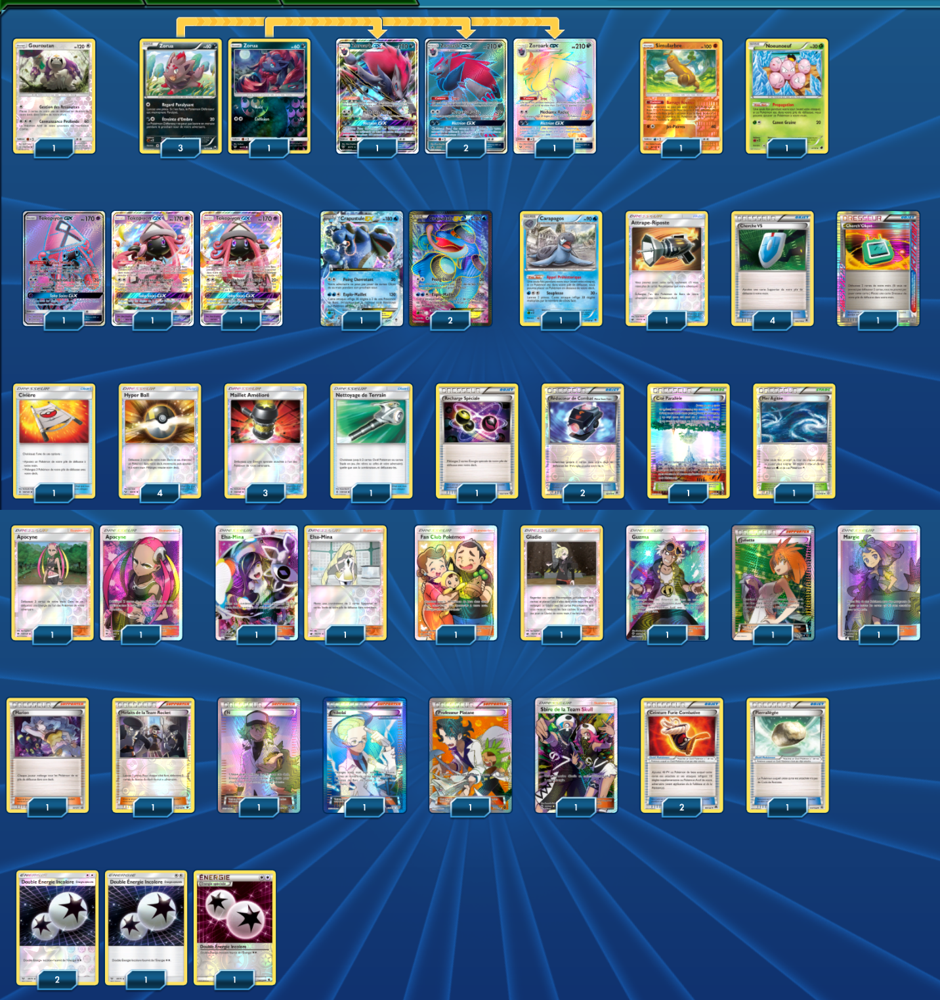

# Zoroark-GX - Crapustule-EX

### Description : 1st Place Portland (Regional 2018). Auteur : Jimmy Pendarvis

 

****** Liste de deck du JCC Pokémon ******

##Pokemon - 18

* 4 Zorua DEX 70
* 4 Zoroark-GX SLG 53
* 3 Seismitoad-EX FFI 20
* 3 Tapu Lele-GX GRI 60
* 1 Exeggcute PLF 4
* 1 Oranguru UPR 114
* 1 Sudowoodo GRI 66
* 1 Tirtouga PLB 27

##Trainer - 38

* 2 Lusamine CIN 96
* 2 Plumeria BUS 120
* 1 Professor Sycamore BKP 107
* 1 N FCO 105
* 1 Colress PLS 118
* 1 Brigette BKT 134
* 1 Pokemon Fan Club FCO 107
* 1 Guzma BUS 115
* 1 Acerola BUS 112
* 1 Team Skull Grunt SUM 133
* 1 Team Rocket's Handiwork FCO 112
* 1 Gladion CIN 95
* 1 Karen PR-XY XY177
* 4 VS Seeker PHF 109
* 4 Ultra Ball SUM 135
* 3 Enhanced Hammer GRI 124
* 2 Battle Compressor PHF 92
* 2 Field Blower GRI 125
* 1 Rescue Stretcher GRI 130
* 1 Counter Catcher CIN 91
* 1 Dowsing Machine PLS 128
* 2 Fighting Fury Belt BKP 99
* 1 Float Stone BKT 137
* 1 Parallel City BKT 145
* 1 Rough Seas PRC 137

##Energy - 4

* 4 Double Colorless Energy SUM 136

Nombre de cartes - 60

****** Liste générée par le JCC Pokémon Online [www.pokemon.fr/JCCO] ******

 

