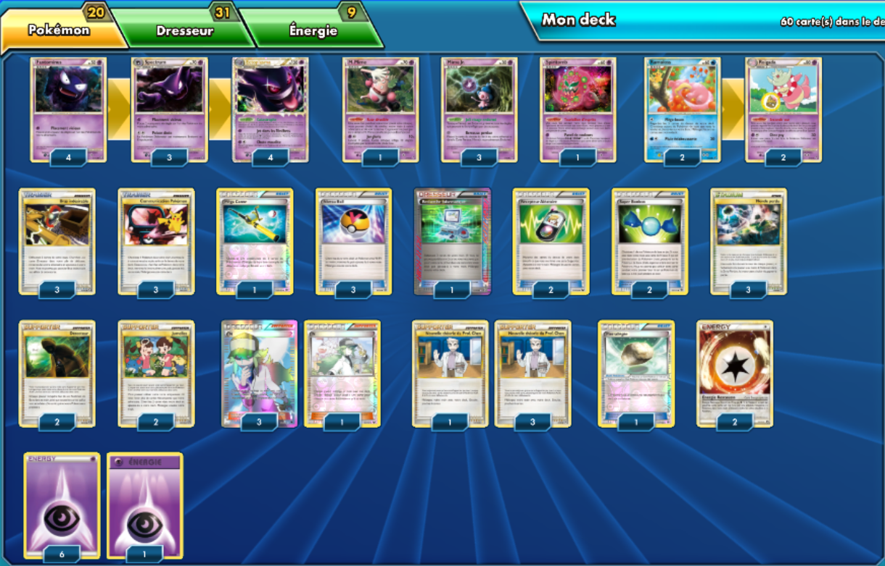

# Dimoret calomnie

### Description : Un deck VRAIMENT UNIQUE en son genre, le deck Ectoplasma prime. Consiste à placer 6 pokémon adverses dans la zone perdue (gràce à la carte stade). Une fois que c'est fait, cliquez sur la carte stade et c'est gagné

 

****** Liste de deck du JCC Pokémon ******
 
##Pokémon - 20
 
* 4 Fantominus TM 63
* 1 M. Mime CL 29
* 3 Mime Jr. CL 47
* 1 Spiritomb TM 10
* 2 Roigada CL 32
* 3 Spectrum TM 35
* 4 Ectoplasma TM 94
* 2 Ramoloss UD 66
 
##Cartes Dresseur - 31
 
* 1 Recherche Informatique BCR 137
* 4 Nouvelle théorie du Prof. Chen CL 83
* 1 Méga Canne BKT 149
* 1 Pierrallégée BKT 137
* 2 Jumelles TM 89
* 3 Niveau Ball AOR 76
* 4 N NVI 101
* 2 Détecteur TM 88
* 2 Super Bonbon PLB 85
* 3 Monde perdu CL 81
* 3 Communication Pokémon HS 98
* 2 Récepteur Aléatoire DEX 99
* 3 Bras indésirable TM 87
 
##Énergie - 9
 
* 7 Énergie Psy EVO 95
* 2 Énergie Rescousse TM 90
 
Nombre de cartes - 60
 
****** Liste générée par le JCC Pokémon Online [www.pokemon.fr/JCCO] ******

 

