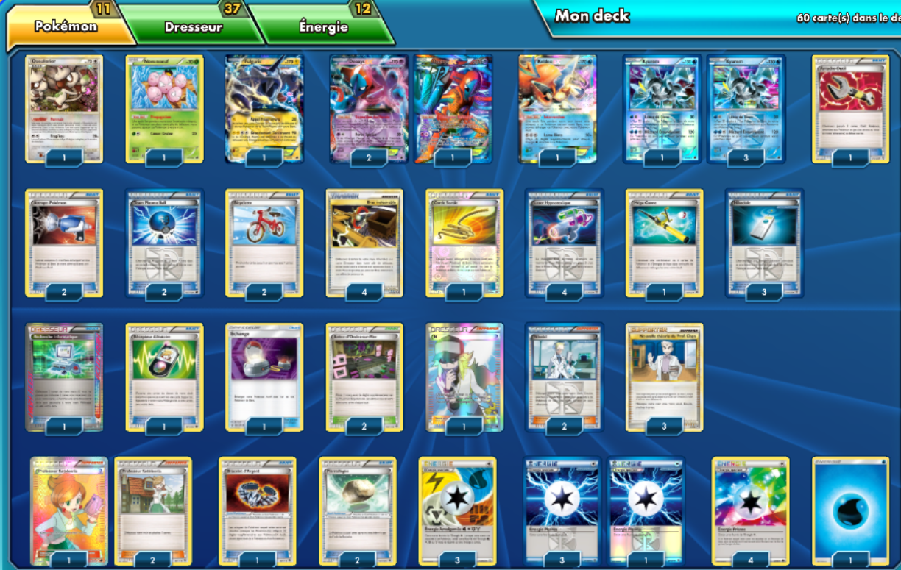

# TDK

### Description : deck méta en héritage.

 

****** Liste de deck du JCC Pokémon ******
 
##Pokémon - 11
 
* 1 Queulorior UD 8
* 1 Noeunoeuf PLF 4
* 1 Fulguris-EX PLF 38
* 3 Deoxys-EX PLF 111
* 1 Keldeo EX BCR 49
* 4 Kyurem PLF 31
 
##Cartes Dresseur - 37
 
* 1 Recherche Informatique BCR 137
* 3 Nouvelle théorie du Prof. Chen CL 83
* 2 Bicyclette PLS 117
* 3 Professeur Keteleeria PLF 116
* 1 Corde Sortie PRC 127
* 1 Bracelet d'Argent PLB 88
* 3 Nikodule PLS 119
* 1 Méga Canne BKT 149
* 4 Laser Hypnotoxique PLS 123
* 2 Attrape-Pokémon EPO 95
* 1 Échange SUM 132
* 2 Balle de la Team Plasma PLF 105
* 2 Arène d'Ondes-sur-Mer PLS 126
* 2 Nikolaï PLS 118
* 1 N NVI 101
* 2 Pierrallégée BKT 137
* 1 Récepteur Aléatoire DEX 99
* 1 Arrache-Outil DRX 116
* 4 Bras indésirable TM 87
 
##Énergie - 12
 
* 1 Énergie Eau  3
* 4 Énergie Prisme NXD 93
* 4 Énergie Plasma PLB 91
* 3 Énergie Amalgamée {W}{L}{F}{M} DRX 118
 
Nombre de cartes - 60
 
****** Liste générée par le JCC Pokémon Online [www.pokemon.fr/JCCO] ******

 

