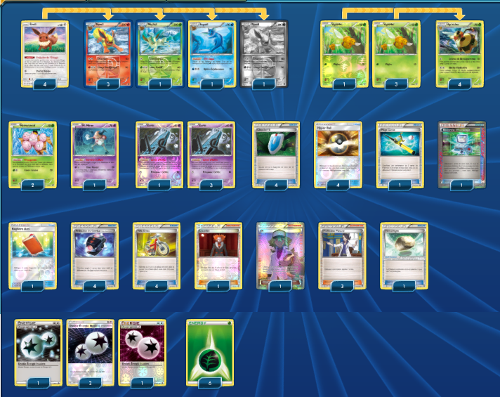

# Hyporoi - Tokorico

### Description : Aucune.

 

****** Liste de deck du JCC Pokémon ******

##Pokémon - 14

* 1 Gouroutan UPR 114
* 1 Cornèbre UPR 71
* 1 Corboss GRI 79
* 1 Tokorico PR-SM SM31
* 2 Tokorico PR-SM SM30
* 3 Hypotrempe BUS 29
* 2 Hypocéan BUS 30
* 3 Hyporoi BUS 31

##Cartes Dresseur - 35

* 1 Professeur Platane STS 114
* 1 Ballon Explosif BKP 97
* 2 N FCO 105
* 1 Registre Ami UPR 132
* 1 Civière GRI 130
* 4 Hyper Ball DEX 102
* 2 Super Bonbon PRC 135
* 2 Carolina BKP 122
* 2 Margie BUS 112
* 1 Méga Canne NVI 95
* 3 Faiblo Ball SUM 123
* 4 Énigme du Temps BKP 109
* 4 Cynthia UPR 119
* 1 Nettoyage de Terrain GRI 125
* 3 Professeur Platane PHF 101
* 2 Guzma BUS 143
* 1 Juliette BKT 161

##Énergie - 11

* 4 Double Énergie Incolore LTR 113
* 7 Énergie Eau  3

Nombre de cartes - 60

****** Liste générée par le JCC Pokémon Online [www.pokemon.fr/JCCO] ******

 

