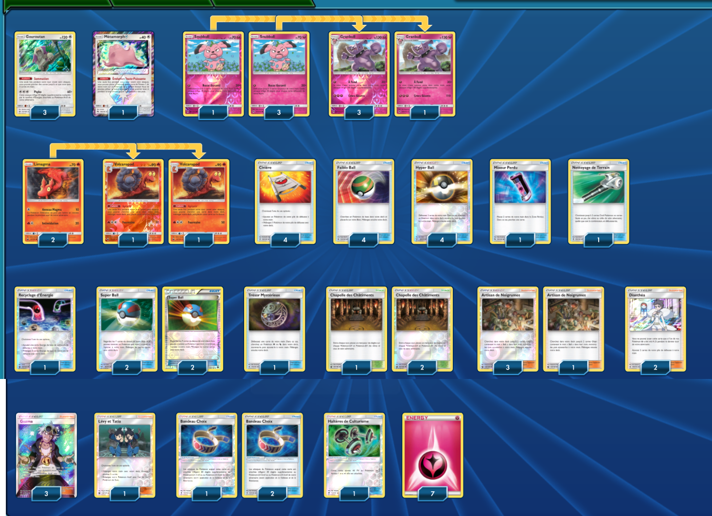

# Granbull - Volcaropod

### Description : Trés bon deck qui a fait de bon résultat dans un tournoi (2éme)

** Liste de deck du JCC Pokémon **

##Pokémon - 16

* 3 Gouroutan SUM 113
* 1 Métamorph {*} LOT 154
* 4 Snubbull LOT 137
* 4 Granbull LOT 138
* 2 Limagma CES 23
* 2 Volcaropod CES 24

##Cartes Dresseur - 37

* 1 Trésor Mystérieux FLI 113
* 4 Civière GRI 130
* 1 Lévy et Tatia CES 148
* 4 Faiblo Ball SUM 123
* 4 Artisan de Noigrumes CES 124
* 1 Nettoyage de Terrain GRI 125
* 3 Guzma BUS 115
* 1 Haltères de Culturisme BUS 113
* 1 Recyclage d’Énergie CES 128
* 4 Hyper Ball SUM 135
* 3 Bandeau Choix GRI 121
* 3 Chapelle des Châtiments CES 143
* 4 Super Ball SUM 119
* 1 Mixeur Perdu LOT 181
* 2 Dianthéa FLI 105

##Énergie - 7

* 7 Énergie Fée GEN 83

Nombre de cartes - 60

** Liste générée par le JCC Pokémon Online [www.pokemon.fr/JCCO] **

