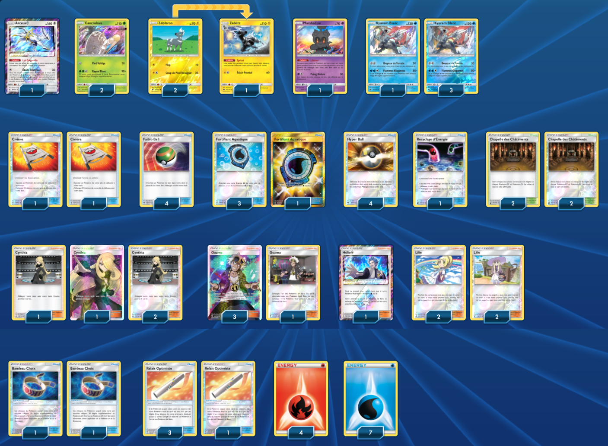

# Kyurem-Blanc

### Description : 

****** Liste de deck du JCC Pokémon ******

##Pokémon - 11

* 1 Arceus {*} FLI 96
* 2 Cancrelove FLI 11
* 2 Zébibron LOT 81
* 1 Zéblitz LOT 82
* 1 Marshadow SLG 45
* 4 Kyurem Blanc LOT 63

##Cartes Dresseur - 38

* 2 Civière GRI 130
* 1 Recyclage d’Énergie CES 128
* 4 Lilie UPR 125
* 4 Relais Optimiste BUS 128
* 2 Bandeau Choix GRI 121
* 4 Chapelle des Châtiments CES 143
* 4 Guzma BUS 115
* 4 Faiblo Ball SUM 123
* 4 Fortifiant Aquatique GRI 161
* 4 Cynthia UPR 119
* 1 Hélio {*} UPR 120
* 4 Hyper Ball SLG 68

##Énergie - 11

* 7 Énergie Eau Energy 3
* 4 Énergie Feu Energy 2

Nombre de cartes - 60

****** Liste générée par le JCC Pokémon Online [www.pokemon.fr/JCCO] ******

