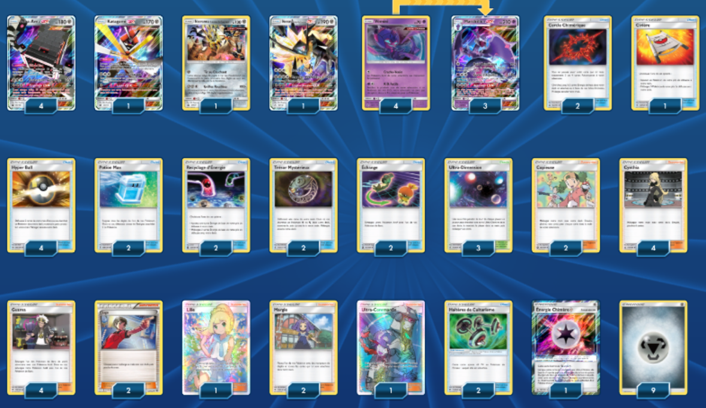

# Mandrillon-GX - Ama-Ama-GX

### Description :
Avec les 4 Ama-Ama-GX et les haltères un Mandrillon-GX peut prendre jusqu'à 280 dégâts et tenir le coup. 
Il faudra souvent a vos adversaires du 2 voire 3 coups pour tuer un Mandrillon-GX une fois les Ama-Ama-GX en place.
Mandrillon GX ayant besoin d'une seule énergie, il peut être soigné avec Margie ou une potion max sans problème. 
Le Katagami-GX peut-être remplacé par Necrozma crinière du couchant (SM107 ou SM124) qui permettra de faire des gros dégâts en fin de partie et de passer les feunard d'alola non GX et les Hoopa ténèbres. 
En fin de partie le Necrozma-GX crinière du couchant et la GX du Ama-Ama-GX pourront être utiles. Les cercles chimériques étant présents principalement pour charger ces Pokémon de fin de partie qui ont besoin de 3/4 énergies pour taper.

 

** Liste de deck du JCC Pokémon **

##Pokémon - 14

* 4 Ama-Ama-GX CES 102
* 1 Katagami-GX CIN 70
* 1 Necrozma Crinière du Couchant PR-SM SM107
* 1 Necrozma Crinière du Couchant-GX UPR 90
* 4 Vémini FLI 55
* 3 Mandrillon-GX FLI 56

##Cartes Dresseur - 36

* 2 Trésor Mystérieux FLI 113
* 1 Ultra-Commando FLI 131
* 1 Civière GRI 130
* 2 Échange CES 147
* 2 Margie BUS 112
* 2 Copieuse CES 127
* 4 Cynthia UPR 119
* 2 Haltères de Culturisme BUS 113
* 4 Guzma BUS 115
* 2 Recyclage d’Énergie CES 128
* 1 Lilie UPR 151
* 4 Hyper Ball SUM 135
* 2 Juge BKT 143
* 3 Ultra-Dimension FLI 115
* 2 Cercle Chimérique FLI 102
* 2 Potion Max GRI 128

##Énergie - 10

* 1 Énergie Chimère {*} FLI 117
* 9 Énergie Métal  8

Nombre de cartes - 60

** Liste générée par le JCC Pokémon Online [www.pokemon.fr/JCCO] **

 

