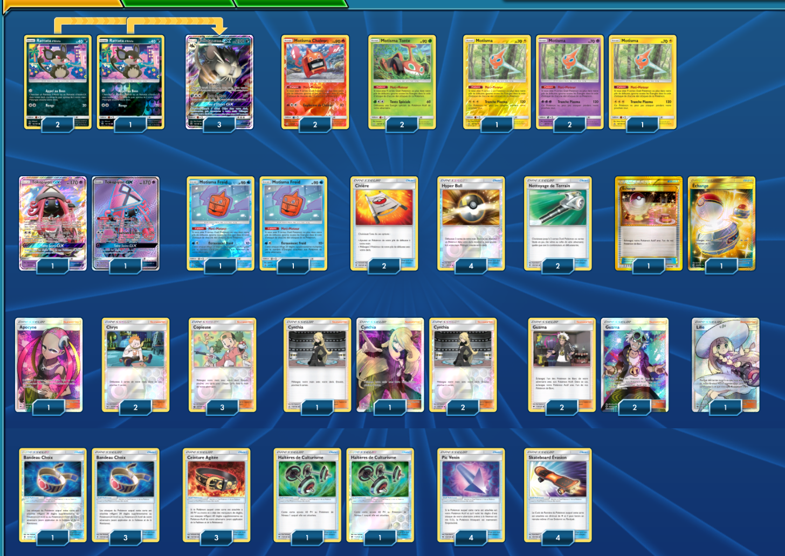

# Motisma - Rattatac d'Alola-GX

### Description : Deck motisma potable vue que gros t'admorve d'alola n'est pas présent.

 

****** Liste de deck du JCC Pokémon ******

##Pokémon - 18

* 3 Rattata d’Alola CES 84
* 3 Rattatac d’Alola-GX CES 85
* 2 Motisma Chaleur UPR 24
* 2 Motisma Tonte UPR 14
* 2 Motisma UPR 50
* 2 Motisma FLI 40
* 2 Tokopiyon-GX GRI 137
* 2 Motisma Froid UPR 41

##Cartes Dresseur - 42

* 4 Pic Venin SUM 124
* 1 Lilie SUM 147
* 3 Ceinture Agitée CES 134
* 2 Civière GRI 130
* 2 Échange PRC 163
* 4 Bandeau Choix GRI 121
* 3 Copieuse CES 127
* 2 Chrys SLG 65
* 4 Cynthia UPR 119
* 2 Haltères de Culturisme BUS 113
* 1 Apocyne BUS 145
* 4 Skateboard Évasion UPR 122
* 2 Nettoyage de Terrain GRI 125
* 4 Guzma BUS 115
* 4 Hyper Ball SLG 68

##Énergie - 0

Nombre de cartes - 60

****** Liste générée par le JCC Pokémon Online [www.pokemon.fr/JCCO] ******

 

