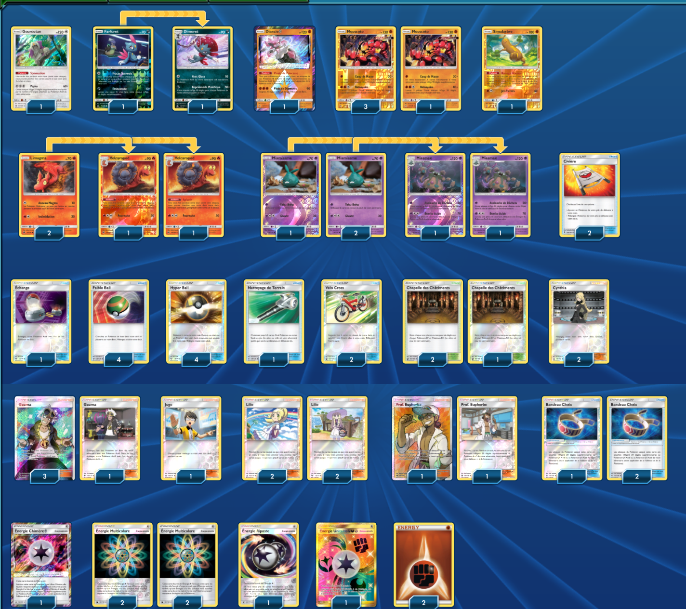

# Mouscoto - Miasmax

### Description : Meuilleur deck pour le moment en standard (avant la sortie de l'extension Tonnerre Perdu)

****** Liste de deck du JCC Pokémon ******

##Pokémon - 18

* 1 Gouroutan SUM 113
* 1 Farfuret UPR 73
* 1 Dimoret UPR 74
* 1 Diancie {*} FLI 74
* 4 Mouscoto FLI 77
* 1 Simularbre GRI 66
* 2 Limagma CES 23
* 2 Volcaropod CES 24
* 3 Miamiasme GRI 50
* 2 Miasmax GRI 51

##Cartes Dresseur - 33

* 4 Lilie UPR 125
* 4 Guzma BUS 143
* 2 Cynthia UPR 119
* 2 Prof. Euphorbe SUM 128
* 1 Juge FLI 108
* 4 Hyper Ball SLG 68
* 4 Faiblo Ball SUM 123
* 2 Vélo Cross CES 123
* 2 Civière GRI 130
* 1 Échange SLG 67
* 1 Nettoyage de Terrain GRI 125
* 3 Bandeau Choix GRI 121
* 3 Chapelle des Châtiments CES 143

##Énergie - 9

* 4 Énergie Multicolore CES 151
* 2 Énergie Combat Energy 6
* 1 Énergie Chimère {*} FLI 117
* 1 Énergie Unitaire {F}{D}{Y} FLI 118
* 1 Énergie Riposte CIN 100

Nombre de cartes - 60

****** Liste générée par le JCC Pokémon Online [www.pokemon.fr/JCCO] ******

