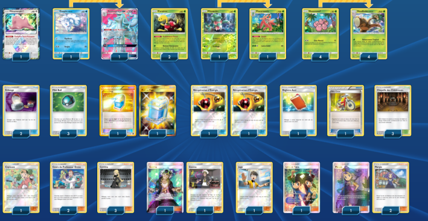
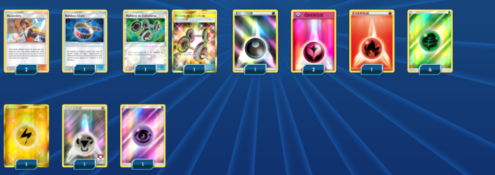

# L'énergie de Noadkoko

### Description:

L'objectif du deck est de defausser les energies, présentes dans le deck grace 
au talent de Caratroc, afin d'atteindre 5 énergies differentes dans la defause,
pour pouvoir taper a 120 de base avec les noadkokos.
Goupix d'alola peux servir pour aller chercher les noadkoko assez rapidement.
Son évolution Feunard d'alola Gx de type fée servira essensiellement a 
aller chercher des objets dans le deck. Dans certains cas il pourra aller punir
les pokemons de types dragons grace a leur faiblesse au type fée, et l'attaque gx
de feunard pourra tuer les Ultra chimères récalcitrantes.
L'energie feu profitera dans certains match up en combo avec l'usine thermique
si jamais le stade est posé.
Les energie noires et violettes profiterons du stade autel de la lune 
dans le cas ou ce stade est posé par l'adversaire.

** Liste de deck du JCC Pokémon **

##Pokémon - 15

* 1 Métamorph {*} LOT 154
* 1 Feunard d’Alola-GX LOT 205
* 2 Caratroc LOT 16
* 1 Mimantis SUM 14
* 4 Noeunoeuf PR-SM SM119
* 1 Floramantis PR-SM SM25
* 4 Noadkoko d’Alola FLI 2
* 1 Goupix d’Alola GRI 21

##Cartes Dresseur - 32

* 2 Cours du Professeur Orme LOT 188
* 3 Margie BUS 142
* 1 Lévy et Tatia CES 166
* 1 Vélo Cross PRC 122
* 1 Registre Ami UPR 132
* 1 Copieuse CES 127
* 2 Guzma BUS 115
* 2 Échange SUM 132
* 3 Cynthia UPR 119
* 2 Haltères de Culturisme BUS 113
* 2 Vacancière LOT 189
* 2 Récupération d’Énergie SUM 116
* 2 Potion Max PLF 121
* 1 Bandeau Choix GRI 121
* 3 Filet Ball LOT 187
* 1 Juge FLI 108
* 3 Chapelle des Châtiments CES 143

##Énergie - 13

* 1 Énergie Électrique GRI 168
* 6 Énergie Plante  1
* 1 Énergie Métal BLW 112
* 1 Énergie Obscurité XYEnergy 1
* 1 Énergie Psy  5
* 2 Énergie Fée EVO 99
* 1 Énergie Feu BLW 106

Nombre de cartes - 60

** Liste générée par le JCC Pokémon Online [www.pokemon.fr/JCCO] **

