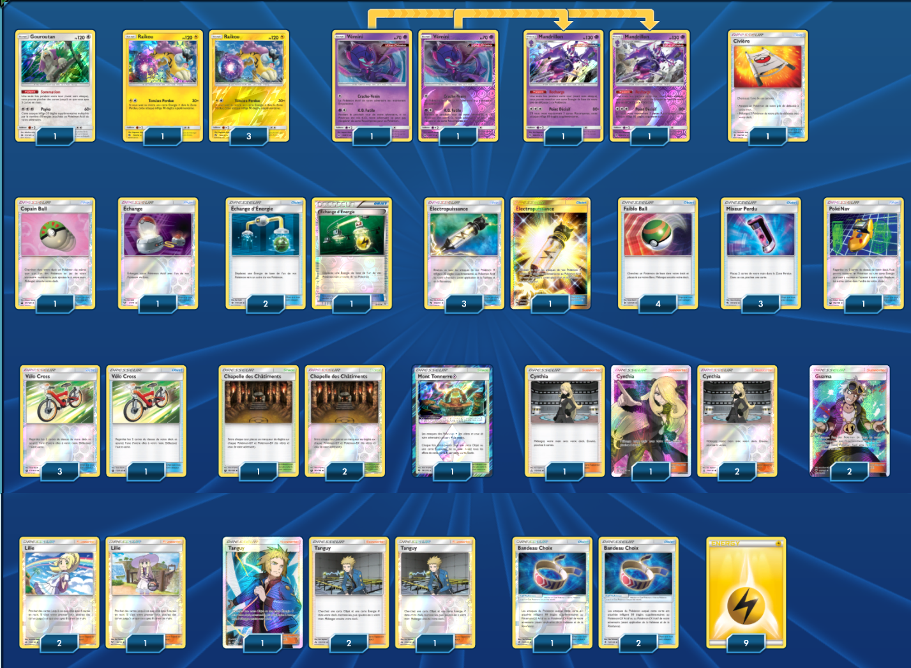

# Raikou

### Description : 
le but c'est de jeter une energie electrique dans la zone perdue et d'attaquer avec raikou
t'as le stade prisme pour faciliter l'enchainement des attaques ainsi que mandrillon et echange d'energie

****** Pokémon Trading Card Game Deck List ******

##Pokémon - 9

* 1 Oranguru SUM 113
* 4 Raikou LOT 79
* 2 Poipole FLI 55
* 2 Naganadel LOT 108

##Trainer Cards - 42

* 1 Switch HS 102
* 1 Thunder Mountain {*} LOT 191
* 1 Rescue Stretcher GRI 130
* 3 Lillie SUM 122
* 4 Acro Bike PRC 122
* 1 Friend Ball CES 131
* 4 Nest Ball SUM 123
* 3 Energy Switch HS 91
* 4 Cynthia UPR 119
* 1 PokéNav CES 140
* 4 Volkner UPR 135
* 2 Guzma BUS 115
* 3 Choice Band GRI 121
* 4 Electropower LOT 172
* 3 Shrine of Punishment CES 143
* 3 Lost Blender LOT 181

##Energy - 9

* 9 Lightning Energy  4

Total Cards - 60

****** Deck List Generated by the Pokémon TCG Online www.pokemon.com/TCGO ******䄯✸

