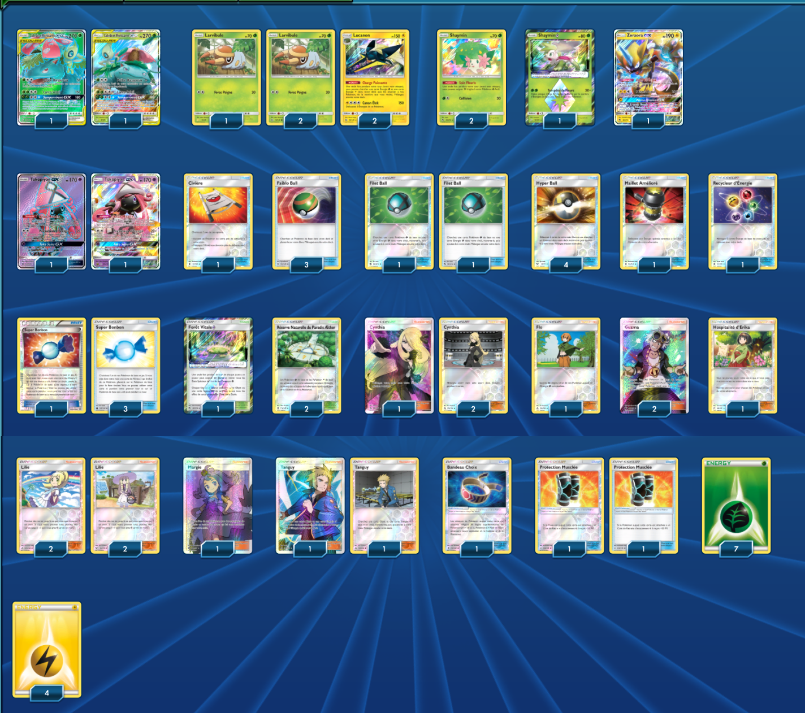

# TagTeam (Florizarre et Celebie) - Lucanon

### Description : 

****** Liste de deck du JCC Pokémon ******

##Pokémon - 13

* 2 Celebi et Florizarre {GX} TEU 1
* 3 Larvibule TK-AlolanRaichu 16
* 2 Shaymin LOT 33
* 1 Shaymin {*} TEU 10
* 1 Zeraora-GX LOT 86
* 2 Lucanon SUM 52
* 2 Tokopiyon-GX GRI 137

##Cartes Dresseur - 36

* 1 Hospitalité d’Erika TEU 140
* 2 Filet Ball LOT 187
* 1 Civière GRI 130
* 4 Hyper Ball SLG 68
* 1 Margie BUS 142
* 2 Tanguy UPR 135
* 4 Lilie UPR 125
* 2 Réserve Naturelle du Paradis Æther GRI 116
* 3 Faiblo Ball SUM 123
* 2 Protection Musclée TEU 136
* 4 Super Bonbon PRC 135
* 3 Cynthia UPR 119
* 2 Guzma BUS 143
* 1 Bandeau Choix GRI 121
* 1 Recycleur d’Énergie GRI 123
* 1 Forêt Vitale {*} LOT 180
* 1 Maillet Amélioré GRI 124
* 1 Flo UPR 124

##Énergie - 11

* 4 Énergie Électrique Energy 4
* 7 Énergie Plante Energy 1

Nombre de cartes - 60

****** Liste générée par le JCC Pokémon Online [www.pokemon.fr/JCCO] ******

