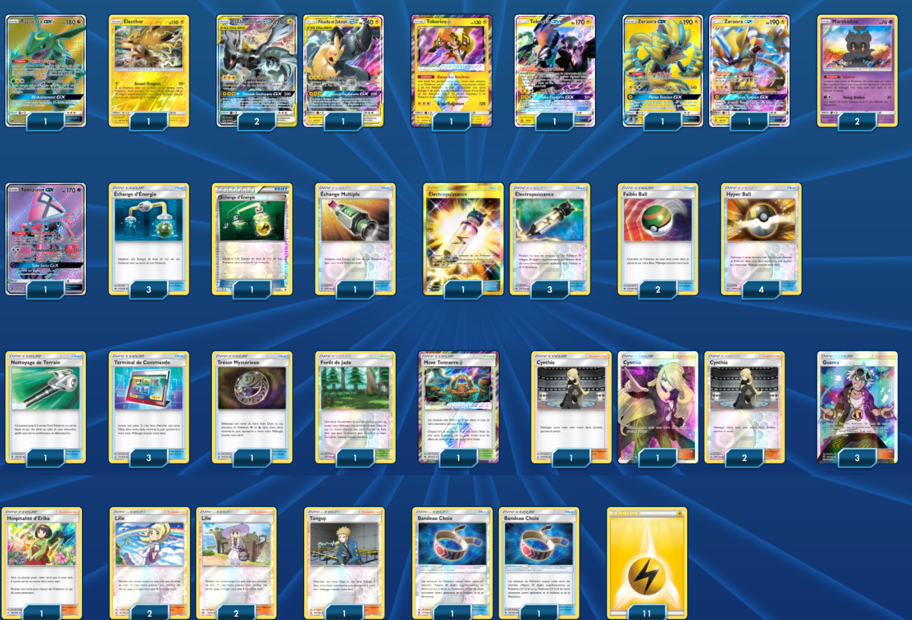

# TagTeam (Pikachu et Zekrom)

### Description : Top 1 Special Event Peru (Tournoi IRL)
### Source : http://limitlesstcg.com/tournaments/?id=169

****** Liste de deck du JCC Pokémon ******

##Pokémon - 12

* 1 Rayquaza-GX CES 160
* 1 Électhor TEU 40
* 3 Pikachu et Zekrom {GX} PR-SM 168
* 1 Tokorico {*} TEU 51
* 1 Tokorico-GX PR-SM 50
* 2 Zeraora-GX LOT 201
* 2 Marshadow SLG 45
* 1 Tokopiyon-GX GRI 137

##Cartes Dresseur - 37

* 1 Mont Tonnerre {*} LOT 191
* 1 Trésor Mystérieux FLI 113
* 4 Lilie UPR 125
* 2 Bandeau Choix GRI 121
* 1 Hospitalité d’Erika TEU 140
* 4 Échange d’Énergie SUM 117
* 4 Électropuissance LOT 232
* 2 Faiblo Ball SUM 123
* 4 Cynthia UPR 119
* 1 Nettoyage de Terrain GRI 125
* 3 Guzma BUS 143
* 4 Hyper Ball SLG 68
* 1 Forêt de Jade TEU 156
* 1 Tanguy UPR 135
* 1 Échange Multiple GRI 129
* 3 Terminal de Commande UPR 131

##Énergie - 11

* 11 Énergie Électrique Energy 4

Nombre de cartes - 60

****** Liste générée par le JCC Pokémon Online [www.pokemon.fr/JCCO] ******

