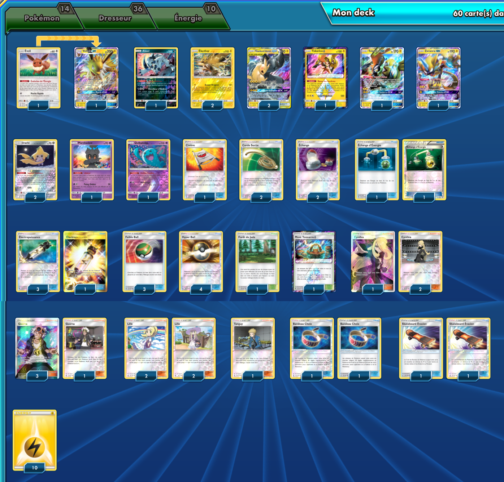

# TagTeam (Pikachu et Zekrom)

### Description : Top 3 International Melbourne (Tournoi IRL)
### Source : http://limitlesstcg.com/decks/?list=1945 

****** Liste de deck du JCC Pokémon ******

##Pokémon - 14

* 1 Évoli SUM 101
* 1 Absol TEU 88
* 2 Électhor TEU 40
* 2 Pikachu et Zekrom {GX} TEU 33
* 1 Tokorico {*} TEU 51
* 1 Tokorico-GX GRI 47
* 1 Zeraora-GX LOT 86
* 1 Voltali-GX PR-SM SM173
* 2 Jirachi TEU 99
* 1 Marshadow SLG 45
* 1 Qulbutoké LOT 93

##Cartes Dresseur - 36

* 2 Skateboard Évasion UPR 122
* 1 Mont Tonnerre {*} LOT 191
* 1 Forêt de Jade TEU 156
* 1 Civière GRI 130
* 4 Lilie UPR 125
* 2 Bandeau Choix GRI 121
* 2 Échange SLG 67
* 2 Échange d’Énergie SUM 117
* 4 Électropuissance LOT 232
* 4 Guzma BUS 115
* 3 Faiblo Ball SUM 123
* 2 Corde Sortie BUS 114
* 3 Cynthia UPR 148
* 4 Hyper Ball SLG 68
* 1 Tanguy UPR 135

##Énergie - 10

* 10 Énergie Électrique Energy 4

Nombre de cartes - 60

****** Liste générée par le JCC Pokémon Online [www.pokemon.fr/JCCO] ******

