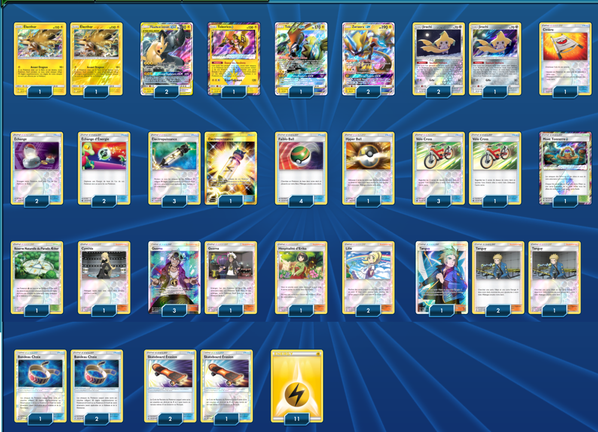

# TagTeam (Pikachu et Zekrom)

### Description : 

****** Liste de deck du JCC Pokémon ******

##Pokémon - 11

* 2 Électhor TEU 40
* 2 Pikachu et Zekrom {GX} TEU 33
* 1 Tokorico {*} TEU 51
* 1 Tokorico-GX GRI 47
* 2 Zeraora-GX LOT 86
* 3 Jirachi TEU 99

##Cartes Dresseur - 38

* 3 Skateboard Évasion UPR 122
* 1 Mont Tonnerre {*} LOT 191
* 1 Civière GRI 130
* 4 Tanguy UPR 156
* 2 Lilie UPR 125
* 3 Bandeau Choix GRI 121
* 2 Échange SLG 67
* 2 Échange d’Énergie CES 129
* 4 Électropuissance LOT 232
* 4 Guzma BUS 115
* 4 Faiblo Ball SUM 123
* 4 Vélo Cross CES 123
* 1 Hyper Ball SLG 68
* 1 Cynthia UPR 119
* 1 Réserve Naturelle du Paradis Æther GRI 116
* 1 Hospitalité d’Erika TEU 140

##Énergie - 11

* 11 Énergie Électrique Energy 4

Nombre de cartes - 60

****** Liste générée par le JCC Pokémon Online [www.pokemon.fr/JCCO] ******

