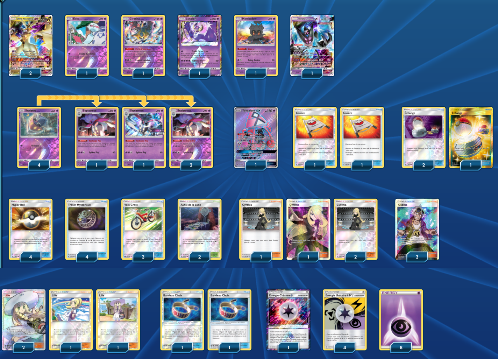

# Ultra-Necrozma - Sepiatroce - Eoko

### Description : 

****** Liste de deck du JCC Pokémon ******

##Pokémon - 16

* 2 Ultra-Necrozma-GX FLI 95
* 1 Éoko CIN 43
* 1 Giratina LOT 97
* 1 Lunala {*} UPR 62
* 1 Marshadow SLG 45
* 1 Necrozma Ailes de l’Aurore-GX UPR 63
* 4 Sepiatop FLI 50
* 1 Tokopiyon-GX GRI 137
* 4 Sepiatroce FLI 51

##Cartes Dresseur - 31

* 4 Trésor Mystérieux FLI 113
* 2 Civière GRI 130
* 4 Lilie UPR 125
* 2 Bandeau Choix GRI 121
* 3 Échange SLG 67
* 4 Cynthia UPR 119
* 3 Vélo Cross CES 123
* 3 Guzma BUS 143
* 4 Hyper Ball SLG 68
* 2 Autel de la Lune GRI 117

##Énergie - 13

* 1 Énergie Chimère {*} FLI 117
* 8 Énergie Psy Energy 5
* 4 Énergie Unitaire {L}{P}{M} UPR 138

Nombre de cartes - 60

****** Liste générée par le JCC Pokémon Online [www.pokemon.fr/JCCO] ******

