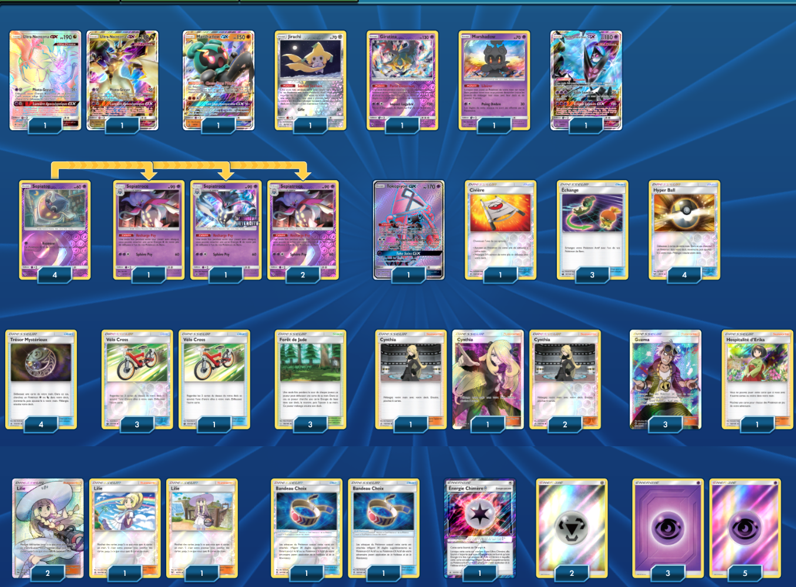

# Ultra-Necrozma - Sepiatroce - Jirachi

### Description : Source ( https://www.youtube.com/watch?v=Nc1GROKsKF0 )

****** Liste de deck du JCC Pokémon ******

##Pokémon - 16

* 2 Ultra-Necrozma-GX FLI 95
* 1 Marshadow-GX PR-SM SM59
* 1 Jirachi TEU 99
* 1 Giratina LOT 97
* 1 Marshadow SLG 45
* 1 Necrozma Ailes de l’Aurore-GX PR-SM SM101
* 4 Sepiatop FLI 50
* 1 Tokopiyon-GX GRI 137
* 4 Sepiatroce FLI 51

##Cartes Dresseur - 33

* 4 Trésor Mystérieux FLI 113
* 3 Forêt de Jade TEU 156
* 4 Lilie UPR 125
* 1 Civière GRI 130
* 3 Échange CES 147
* 4 Cynthia UPR 119
* 3 Guzma BUS 143
* 4 Hyper Ball SLG 68
* 1 Hospitalité d’Erika TEU 140
* 2 Bandeau Choix GRI 121
* 4 Vélo Cross CES 123

##Énergie - 11

* 1 Énergie Chimère {*} FLI 117
* 8 Énergie Psy  5
* 2 Énergie Métal  17

Nombre de cartes - 60

****** Liste générée par le JCC Pokémon Online [www.pokemon.fr/JCCO] ******

