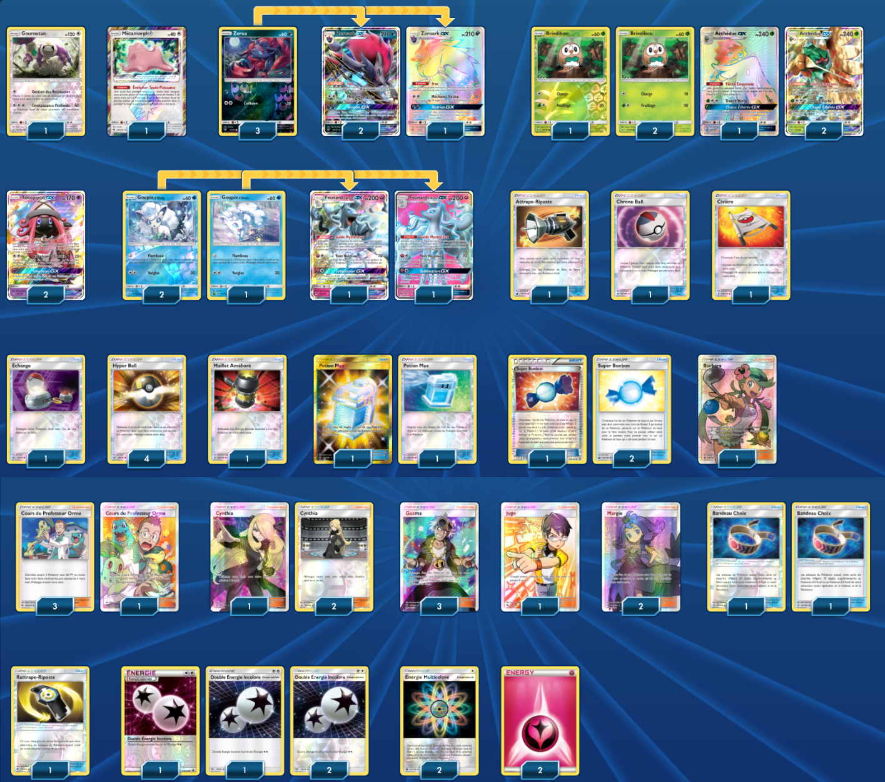

# Zoroark GX - Archéduc GX - Feunard Alola GX

### Description : Vainqueur tournoi du Regional Brisbane (http://limitlesstcg.com/tournaments/?id=146)

****** Liste de deck du JCC Pokémon ******

##Pokémon - 21

* 1 Gouroutan UPR 114
* 1 Métamorph {*} LOT 154
* 3 Zorua SLG 52
* 3 Zoroark-GX SLG 77
* 2 Feunard d’Alola-GX LOT 205
* 3 Brindibou SUM 9
* 3 Archéduc-GX SUM 12
* 2 Tokopiyon-GX GRI 60
* 3 Goupix d’Alola GRI 21

##Cartes Dresseur - 31

* 4 Cours du Professeur Orme LOT 188
* 2 Margie BUS 142
* 1 Civière GRI 130
* 1 Maillet Amélioré GRI 124
* 1 Chrono Ball SUM 134
* 3 Super Bonbon PRC 135
* 2 Bandeau Choix GRI 121
* 1 Rattrape-Riposte LOT 170
* 1 Échange SLG 67
* 3 Cynthia UPR 148
* 3 Guzma BUS 143
* 2 Potion Max GRI 164
* 1 Attrape-Riposte CIN 91
* 4 Hyper Ball SLG 68
* 1 Barbara GRI 145
* 1 Juge LOT 209

##Énergie - 8

* 2 Énergie Multicolore CES 151
* 2 Énergie Fée Energy 9
* 4 Double Énergie Incolore FCO 114

Nombre de cartes - 60

****** Liste générée par le JCC Pokémon Online [www.pokemon.fr/JCCO] ******

