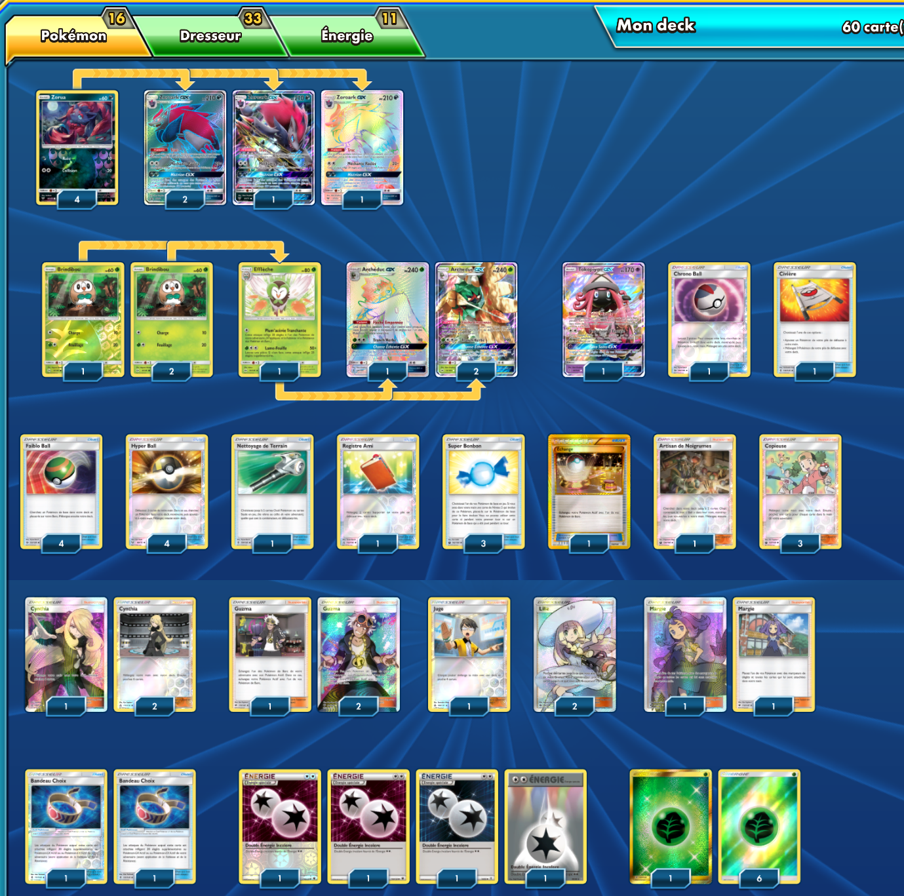

# Zoroark-GX - Archéduc-GX

## Description : Peut-être enlever un bandeau et mettre un nettoyage de terrain. À vous d'en juger.

 

****** Liste de deck du JCC Pokémon ******

##Pokémon - 16

* 4 Zorua SLG 52
* 4 Zoroark-GX SLG 77
* 3 Brindibou SUM 9
* 1 Efflèche SUM 10
* 3 Archéduc-GX SUM 12
* 1 Tokopiyon-GX GRI 60

##Cartes Dresseur - 38

* 2 Margie BUS 142
* 1 Registre Ami UPR 132
* 2 Lilie SUM 147
* 2 Civière GRI 130
* 1 Échange PRC 163
* 3 Chrono Ball SUM 134
* 3 Bandeau Choix GRI 121
* 3 Copieuse CES 127
* 4 Faiblo Ball SUM 123
* 1 Nettoyage de Terrain GRI 125
* 3 Guzma BUS 115
* 3 Cynthia UPR 148
* 4 Hyper Ball SLG 68
* 1 Artisan de Noigrumes CES 124
* 2 Juge FLI 108
* 3 Super Bonbon CES 142

##Énergie - 6

* 2 Énergie Plante GRI 167
* 4 Double Énergie Incolore FCO 114

Nombre de cartes - 60

****** Liste générée par le JCC Pokémon Online [www.pokemon.fr/JCCO] ******

 

