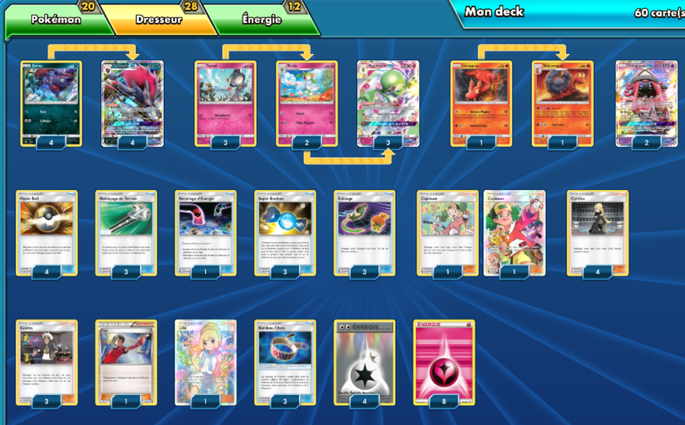

# Zoroark-GX - Gardevoir GX

### Description : Aucune

** Liste de deck du JCC Pokémon **

##Pokémon - 20

* 4 Zorua PR-SM SM83
* 4 Zoroark-GX SLG 53
* 3 Tarsal BUS 91
* 2 Kirlia BUS 92
* 3 Gardevoir-GX BUS 93
* 1 Limagma CES 23
* 1 Volcaropod CES 24
* 2 Tokopiyon-GX GRI 60

##Cartes Dresseur - 28

* 3 Échange CES 147
* 3 Super Bonbon SUM 129
* 2 Copieuse CES 127
* 4 Cynthia UPR 119
* 3 Nettoyage de Terrain GRI 125
* 3 Guzma BUS 115
* 1 Recyclage d’Énergie CES 128
* 1 Lilie UPR 151
* 4 Hyper Ball SUM 135
* 1 Juge BKT 143
* 3 Bandeau Choix GRI 121

##Énergie - 12

* 8 Énergie Fée GEN 83
* 4 Double Énergie Incolore EVO 90

Nombre de cartes - 60

** Liste générée par le JCC Pokémon Online [www.pokemon.fr/JCCO] **

