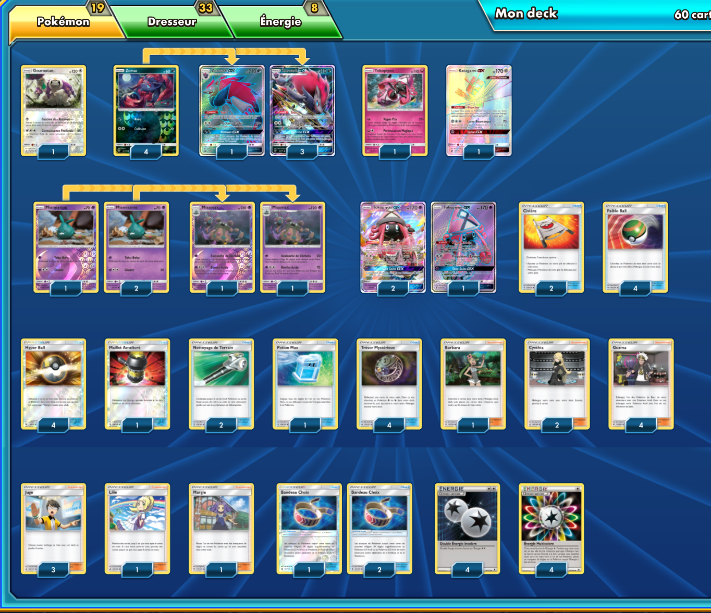

# Zoroark-GX - Miasmax

## Description : Voici une decklist de Zoroark Miasmax qui a fait top 4 a une League Cup (Septembre 2018).

 

****** Liste de deck du JCC Pokémon ******

##Pokémon - 19

* 1 Gouroutan UPR 114
* 4 Zorua SLG 52
* 4 Zoroark-GX PR-SM SM84
* 1 Tokopiyon UPR 94
* 1 Katagami-GX CIN 117
* 3 Miamiasme GRI 50
* 3 Tokopiyon-GX GRI 60
* 2 Miasmax GRI 51

##Cartes Dresseur - 33

* 3 Juge FLI 108
* 1 Lilie UPR 125
* 1 Margie BUS 112
* 1 Barbara GRI 127
* 4 Guzma BUS 115
* 4 Hyper Ball SLG 68
* 4 Trésor Mystérieux FLI 113
* 4 Faiblo Ball SUM 123
* 2 Nettoyage de Terrain GRI 125
* 2 Civière GRI 130
* 2 Cynthia UPR 119
* 3 Bandeau Choix GRI 121
* 1 Maillet Amélioré GRI 124
* 1 Potion Max GRI 128

##Énergie - 8

* 4 Double Énergie Incolore PHF 111
* 4 Énergie Multicolore BKT 152

Nombre de cartes - 60

****** Liste générée par le JCC Pokémon Online [www.pokemon.fr/JCCO] ******

 

