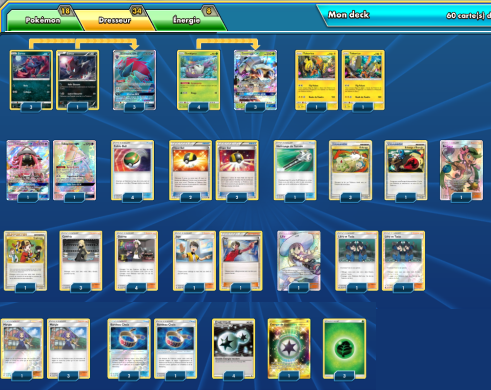

# Zoroark-GX - Sarmurai-GX

##Pokémon - 18

* 1 Zorua BKT 89
* 3 Zorua SLG 52
* 3 Zoroark-GX PR-SM SM84
* 4 Sovkipou BUS 16
* 3 Sarmuraï-GX BUS 17
* 2 Tokorico PR-SM SM30
* 2 Tokopiyon-GX GRI 60

##Cartes Dresseur - 34

* 4 Margie BUS 112
* 1 Lilie SUM 147
* 1 Échange d'Énergie HS 91
* 3 Échange HS 102
* 4 Hyper Ball DEX 102
* 3 Bandeau Choix GRI 121
* 2 Juge FLI 108
* 1 Copieuse HS 90
* 2 Lévy et Tatia CES 148
* 4 Faiblo Ball SUM 123
* 3 Cynthia UPR 119
* 1 Nettoyage de Terrain GRI 125
* 4 Guzma BUS 115
* 1 Barbara GRI 145

##Énergie - 8

* 4 Double Énergie Incolore NXD 92
* 3 Énergie Plante  1
* 1 Énergie de Distorsion CIN 123

