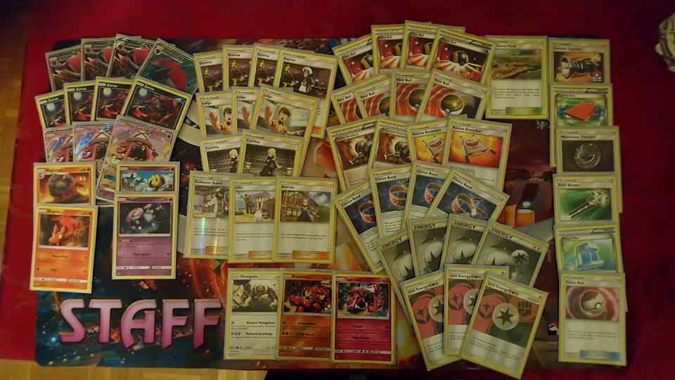

# Zoroark-GX Volcaropod

J'ai fait Top 4 à un tournoi à Lyon le 16 septembre avec ce deck

Matchups :
Ronde 1 contre VikaBulu
Mon adversaire sortait 1 Lucanon à la fois mais chaque fois que je le mettais KO elle sortait un autre le tour suivant, donc j'ai perdu les deux manches
0-1

Ronde 2 contre Mouscoto Miasmax Chapelle
J'ai passé la première game à défausser toutes les Chapelles avec Nettoyage et mon stade, à soigner mes GXs, à garder un truc inutile en actif et à défausser ses énergies spéciales grâce à Gouroutan.  Finalement il n'avait plus grand chose donc j'ai pris 6 récompenses rapidement.  On n'avait pas assez de temps pour compléter le deuxième game
1-1

Ronde 3 contre Miasmax Sarmuraï Mentali Weavile
J'avais rien le premier game mais il avait un deck moins consistent donc quand je faisait juge je gérait mieux que lui et donc j'ai gagné les deux prochains manches
2-1

Ronde 4 contre Magnezone
À chaque fois qu'il jouait Lilie, Pierre ou que j'avais une suspicions qu'il avait Super Bonbon Magnezone en main j'ai joué Juge et il pouvait pas s'en sortir
3-1

Ronde 5 contre Zoroark Lougaroc
La première manche il n'avait rien
La deuxième il lui restait 2 récompenses et moi 1 mais il a eu le Lougaroc+DCE+Multi Switch pour KO un Zoroark
La 3eme j'ai fait Juge T1 et il n'avait rien

Top 4 contre Zoroark Sarmuraï
La première j'ai fait exactement ce que le déck devrait faire, la deuxième et troisième j'ai fait du n'importe quoi mais il y aura une vidéo que vous pourriez regarder

J'espère que vous trouvez ça utile ou intéressant ; le déck n'est pas le même sans Mesprit

** 2019 ZoroCargo **

##Pokémon - 18

* 3 Zoroark-GX SLG 53
* 1 Zoroark-GX PR-SM SM84
* 4 Zorua SLG 52
* 3 Tapu Lele-GX GRI 60
* 1 Oranguru UPR 114
* 1 Tapu Lele UPR 94
* 1 Uxie FLI 41
* 1 Mesprit FLI 42
* 1 Buzzwole FLI 77
* 1 Magcargo CES 24
* 1 Slugma CES 23

##Trainer Cards - 35

* 3 Judge FLI 108
* 2 Cynthia UPR 119
* 1 Lillie SUM 122
* 4 Ultra Ball DEX 102
* 4 Nest Ball SUM 123
* 1 Mysterious Treasure FLI 113
* 4 Choice Band GRI 121
* 1 Pal Pad FLF 92
* 2 Rescue Stretcher GRI 130
* 1 Professor Kukui SUM 128
* 1 Timer Ball SUM 134
* 1 Acerola BUS 112
* 1 Max Potion EPO 94
* 1 Devoured Field CIN 93
* 1 Field Blower GRI 125
* 2 Enhanced Hammer DEX 94
* 4 Guzma BUS 115
* 1 Counter Catcher CIN 91

##Energy - 7

* 4 Double Colorless Energy HS 103
* 3 Unit Energy FightingDarknessFairy FLI 118

Total Cards - 60

** Deck List Generated by DeckBox **

